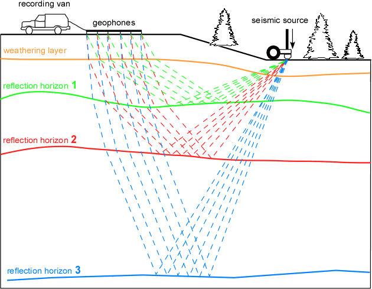
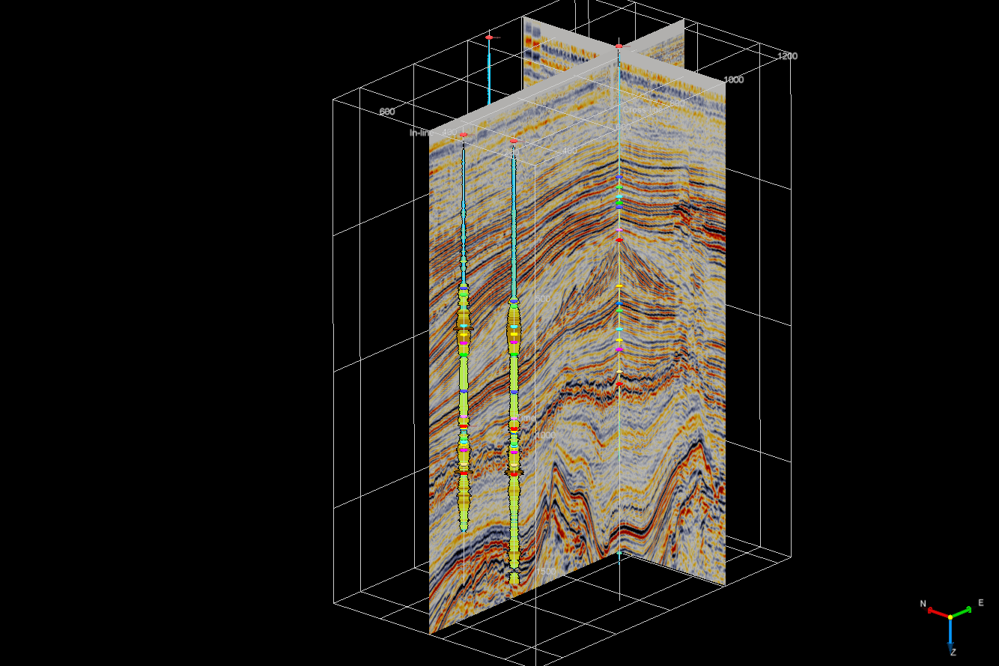
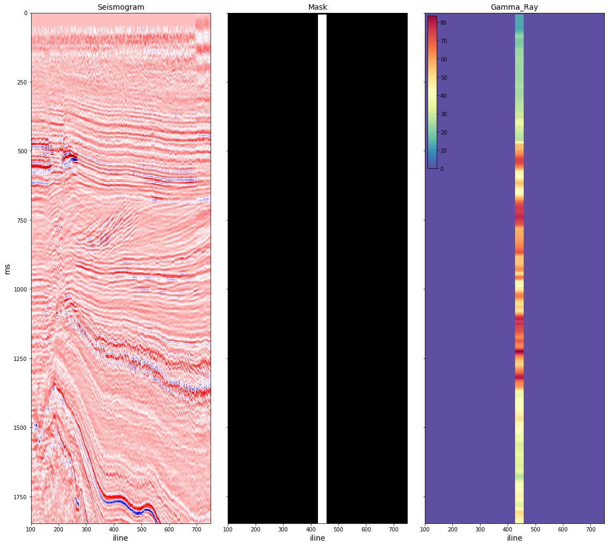

# Seismic interpretation
In this ML recipe, we demonstrate a simplified version of Seismic interpretation project, a recent development of Neuromation in the field of commercial oil exploration.   

### Introduction

Seismic methods are based on the study of elastic wave propagation inside the earth. These waves are generated by explosions on the earth’s surface or by seismic sources in the earth’s crust. The seismic receivers, geophones, record on the surface of the earth the echo signal reflected from deep geological structures. The spatial structure of a seismic signal depends on the velocity of elastic wave propagation, which is a function of the physical parameters of rock formations (rock composition, porosity, fracture, moisture saturation, etc.) [link](https://www.sciencedirect.com/topics/earth-and-planetary-sciences/seismic-method)

  
Reflection seismic surveying ([source](https://geoexpert.ch/methods/reflection-seismic-surveying/))

Post processing of the reflected signal allows to form a 2D seismic cross-section or a 3D array, a seismic cube. The horizontal axes of the seismic cube are located along the earth’s surface and usually measured in meters. The vertical axis represents depth and usually measured in units of time (occasionally - of distance). The cube is divided into vertical cross-sections along the axis of receivers (_inlines_) and across the axis of receivers (_crosslines_, _xlines_). Intersections of inlines and  crosslines make vertical lines (_seismic traces_). [link](https://medium.com/seismic-data-analysis-using-ai/seismic-data-analysis-using-ai-3ce18a18fbb)

  
An example of seismic cube ([source](http://cge.rosgeo.com/en/services/glubinnaya-3d-migraciya-do-summirovaniya/))

Seismic interpretation is a method of assessing petrophysical features of the subsurface from well-log and seismic data. Petrophysical data such as radioactivity, porosity, acoustic impedance, density, conductivity etc. are being logged at specific well locations and depths. Seismic data is a 3D representation of the entire reservoir area. The goal of seismic interpretation is finding an estimator from seismic data to the sparsely available well-log data so that petrophysical data can be predicted from the seismic data for the entire reservoir volume. 


### Data
For demonstration purposes, we use open data from the Netherlands Offshore F3 Block, [link](https://terranubis.com/datainfo/Netherlands-Offshore-F3-Block-Complete). F3 is a block in the Dutch sector of the North Sea. The block is covered by 3D seismic that was acquired to explore for oil and gas in the Upper-Jurassic - Lower-Cretaceous strata.  The characteristics of the 3D seismic survey are the following: 
- inline range: 100 through 750 lines, 25 m/line step
- crossline range: 300 through 1250 lines, 25 m/line step
- Z range: 0 though 1848 ms, 4 ms step
- area: 375.31 km^2
 
Within the survey, only four vertical wells are present. All wells have sonic and gamma ray logs. In this demo, we implement 4-fold crossvalidation training our model on 3 wells and validating on the remaining well.



### Method
The model is a 2D-2D transcoder network trained to convert a 2D seismic image into 2D petrophysical image:


As input, we use vertical 2D seismic slices in the neighbourhood of the 4 wells. We crop 21 x 2 nearest slices along two horizontal inline/crossline axes. Training targets are being constructed as vertical projection of petrophysical data onto corresponding seismic plane. We transform 1D logs into 2D image adding second dimension and expanding it to 20-30 traces. Obviously, these targets cover only small region of a seismic slice, and training is implemented with 2D masked Mean Squared Error (MSE) loss.

An example of data unit: 


### Results

We crossvalidate Gamma log model on the dataset of 168 projections (4 wells x 2 horizontal dimensions x 21 slice in each direction). We minimize masked MSE loss for 150 epochs. The model typically converges after 50 epochs. The Pearson correlation between true and predicted well logs is remarkably high, especially taking into account the limited size of the training data:

|well|correlation|
|:---:|:---:|
|F02-1|0.88|
|F03-2|0.70|
|F03-4|0.82|
|F06-1|0.81|
|**average**|0.80|



Needless to say that 4 item dataset isn't enough to draw serious conclusions from any ML project. The goal of this recipe is to demonstrate potential of the method with open seismic data. The commercial project this study is based on reaches correlation of ~90% and low MSE using proprietary data with large number of wells of complex geometry and other petrophysical properties.

## Quick Start

##### 0. Sign up at [neu.ro](https://neu.ro) 
##### 1. Setup your local machine according to [instructions](https://neu.ro/docs) and log in
```shell
pip install -U neuromation
neuro login
```
##### 2. Run the recipe
```shell
`git clone git@github.com:neuromation/ml-recipe-seismic.git
git clone https://github.com/neuromation/ml-recipe-seismic.git
cd ml-recipe-seismic
make setup
make jupyter
```
##### 3. Run notebooks:

```shell
neuro login
make setup
make jupyter
```

See [Help.md](HELP.md) for the detailed Neuro Project Template Reference.
