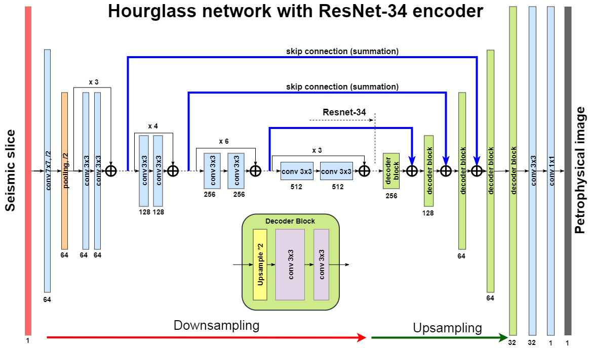
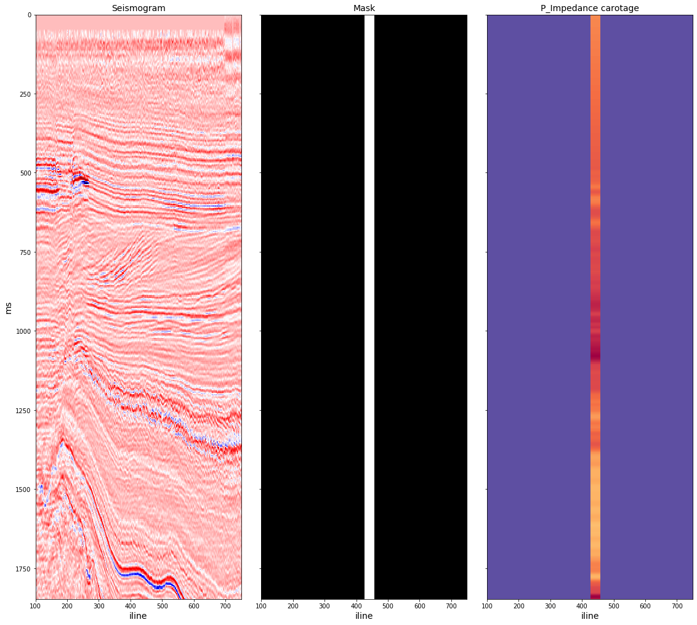

# Seismic interpretation

In this ML recipe, we demonstrate a simplified version of Seismic interpretation project, a recent development of Neuromation in the field of commercial oil exploration.   

##### Introduction

##### Data
For demonstration purposes, we use open data from the Netherlands Offshore F3 Block, [link](https://terranubis.com/datainfo/Netherlands-Offshore-F3-Block-Complete). F3 is a block in the Dutch sector of the North Sea. The block is covered by 3D seismic that was acquired to explore for oil and gas in the Upper-Jurassic - Lower-Cretaceous strata.  The characteristics of the 3D seismic survey are the following: 
- inline range: 100 through 750 lines
- crossline range: 300 through 1250 lines
- inline/crossline bin size: 25 m/line
- Z range: 0 though 1848 ms, 4 ms step
- area: 375.31 km^2

Within the survey, only four vertical wells are present. All wells have sonic and gamma ray logs. In this demo, we implement 4-fold crossvalidation training our model on 3 wells and validating on the remaining well.

##### Method
The model is 2D-2D hourglass transcoder network trained to convert a 2D seismic slice into 2D carotage picture:



As input, we use multiple inlines/crosslines in the neighbourhood of the 4 wells. We use 21 nearest slices along each horizontal dimension. Training targets are being constructed as vertical projection of carotage data onto corresponding seismic slices. We transform 1D carotage data into 2D image by adding second dimension and expanding it to 20-30 traces. Obviously,these targets cover only small region of a seismic slice, and training is implemented with 2D masked MSE loss.
 


##### Results
## Quick Start

Sign up at [neu.ro](https://neu.ro) and setup your local machine according to [instructions](https://neu.ro/docs).
 
Then run:

```shell
neuro login
make setup
make jupyter
```

See [Help.md](HELP.md) for the detailed Neuro Project Template Reference.
